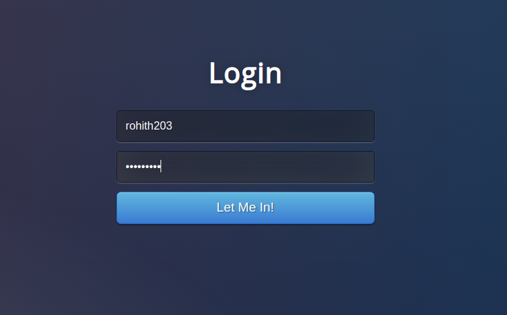

# Blockchain based chatroom application

This repository contains the implementation of blockchain its usage in building a chatroom.

python 3.x has been used in this project.

required modules:
- flask
- flask-cors
- urllib
- jsonify
- requests

running a blockchain server:
- git clone https://github.com/rohith203/Blockchain_chatroom.git
- cd ChatApp

- ~~~~~~~~~~
  python server.py <port>
  ~~~~~~~~~~

 

The frontend can be viewed in http://localhost:port/
- The first page is a login page. The user has to login with their
username and secret key ( password ).

<figure>
    
  <figcaption>Login page UI</figcaption>
</figure>

-  A new user is created if the username is not present. Public keys are created using keygen.py and shared among all nodes using public_keys.json file.
- Each time an old user logins, their identity is verified using discret log verification.
- After successful verification, the chatroom appears. The user can send a message only when their secret key is entered in the text box besides the logout button.

### chatroom on different nodes
<figure>
    
  <figcaption>Chatroom UI on 3 different nodes.</figcaption>
</figure>

 
 

The following main features have been implemented in the blockchain:
- createBlock() method creates a block with the given data.
- mineBlock() method finds the nonce value required to create a new block and adds it to the blockchain.
- verifyTransaction() method uses zero knowledge proof with discrete log mathematics to verify the identity of a user who makes a transaction (in this case, sending a message).
- viewUser() method in server.py returns all transactions (messages) associated with a particular user.

- /replace_chain endpoint is used to ensure blockchains in all other nodes are updated when a new block is mined.
- /get_chain endpoint returns the blockchain in json format

Blockchain implementation details:

## Blockchain class

### Constructor
    params
    chain  : a list of blocks.
    data   : temporary storage of data, yet to be mined
    storage: used for verification of a transaction.
    nodes  : set of nodes through which the blockchain is distributed

    This constructor creates a genesis block, and connects the current
    node with all other nodes.

### createBlock ( nonce, previous_hash ):
    params
    nonce         : an integer value used in proof of work
    previous_hash : hash value of the previous block
    returns       : a block

    This function constructs a block. The block contains
    index         : block number in the chain,
    timestamp     : time at which the block is created,
    nonce         : an integer value used for proof of work,
    previous_hash : hash value of the previous block,
    data          : set of transactions (messages)

### get_previous_block():
    This method returns the last block in the blockchain.

### proof_of_work(previous_nonce):
    params
    previous_nonce: nonce value used previously.

    This function implements the proof of work in blockchain. For each nonce value, hash of new_nonce^2 - previous_nonce^2 is calculated using sha256, if the hex value has '0000' in its beginning, then the new_nonce is accepted and it is returned.

### hash ( block ):
    params
    block: a block of blockchain.

    This function takes a block as input and returns its hash value
    calculated using sha256 algorithm.

### is_chain_valid ( chain ):
    params
    chain: blockchain, list of blocks

    This function takes a blockchain as input and check if
    the previous hash values in the blocks are correct. It also
    checks if the nonce values are valid or not.

### add_data(sender, msg, param, param_type):
    params
    sender     : username of the message sender
    msg        : content of the message
    param      : h/s depending on param_type
    param_type : h/s

    This function is used in multiple ways depending on param type
    1) when mining a block it returns -1 or -2
    2) when the user sends h, it returns a random bit b.
    3) when the user sends s, it verifies the transaction
    using public key of the user and the method 'verifyTransaction'.
    if the transaction is verified, it adds the transaction(msg) to data variable and returns the new index.

### verifyTransaction ( A, B, p ):
    This function verifies a transaction using 
    public key of a user (A, B, p) using discrete log math.

    A : generator
    B : (A^x)(mod p)
    p : large prime number
    
    - The user sends h = (A^r)(mod p) where r is a random number generated by the user. 
    - the verifier sends a random bit b
    - the user sends s = (r+bx)(mod (p-1))
    - This function computes (A^s)(mod p) and h(B^b)(mod p).

    If these two values are equal, the transaction is considered
    to be verified, else not.

    Note: The user sends h, s using the endpoint /add_data and
    the verifier sends b using the method add_data() in blockchain class.

## Server endpoints

### /:
    This is the root endpoint. Post method to '/' takes care of user verification. If not verified, the user is redirected to login page.

### /verify_user:
    The function for this endpoint is used during login to verify
    the user's identity

### /chatroom/<username>:
    The function for this endpoint displays the chatroom when a verified
    user is logged in.

### /logout:
    This function logs out a user from the chatroom.

### /add_user:
    This function checks if a username name already exists, if not creates a new public key, private key pair using keygen.py and stores the public key in public_keys.json

### /mine_block:
    The function (mineBlock()) for this endpoint invokes the add_data method
    of blockchain class to create a new block at the end of the blockchain using transactions (msgs) present in the blockchain.data variable.

### /get_chain:
    It returns the whole blockchain in json format.

### /view_user:
    This endpoint returns all the messages of a particular
    user in the blockchain.

### /is_valid:
    It checks if the blockchain is valid using is_chain_valid method of 
    blockchain class.

### /add_data:
    The function for this endpoint is the prover in the transaction verification process. If successful in the verification, the new message
    is added to the msg queue of blockchain.

### /connect_node:
    It connects the current blockchain node to other nodes present 
    in the nodes.json file.

### /replace_chain:
    This function replaces the current blockchain with the longest
    chain among all nodes in the distributed system.

### /get_public_keys:
    This function returns the public keys of a user
    from the public_keys.json file.